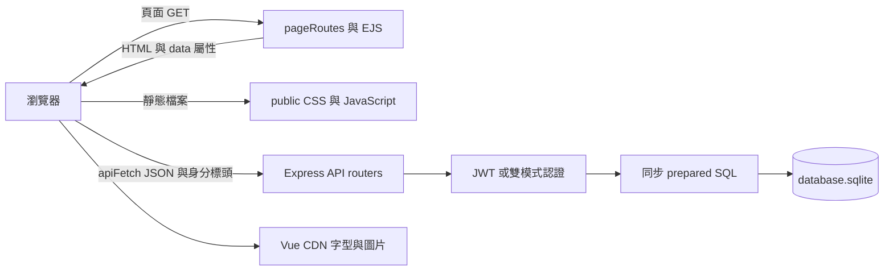

# 架構與資料流

## 架構邊界與技術決策

本專案是單一 Express 應用，包含 JSON API、EJS 頁面與靜態檔案。後端沒有獨立 service、repository、controller、ORM、queue 或 migration 系統。路由直接執行同步 better-sqlite3 SQL；新增業務規則時，必須檢查所有直接讀寫同一張表的路由，不能假設已有共同領域服務處理一致性。

EJS 只渲染版型與少量路由參數，商品、購物車、訂單內容由 Vue 在瀏覽器透過 API 取得。頁面導航會重新載入 HTML，不使用 Vue Router。Vue 由 CDN 提供，npm 只建置 CSS，沒有前端 JavaScript bundler。



關鍵整合決策：會員與訪客購物車為不同 owner；歷史訂單儲存商品快照；庫存於建單扣除；ECPay 付款僅由後端查詢與驗簽更新；管理 API 才是真正權限邊界；資料庫載入具有建表及 seed 副作用。這些行為會直接影響新增登入、刪除商品、退貨、運費與付款功能。

## 目錄與逐檔用途

以下涵蓋檢視時所有第一方原始碼、模板、測試及設定，不逐項列第三方 `node_modules` 或 Git 內部物件。`.codex/` 是原本存在的本機設定，檢視時尚未被 Git 追蹤。

### 根目錄、工具與產物

| 檔案 | 用途與整合關係 |
| --- | --- |
| `app.js` | dotenv、建表、Express 設定、middleware／router 掛載、API／HTML 404、集中錯誤處理；匯出 app 供測試 |
| `server.js` | 引入 app；直接執行時檢查 JWT_SECRET、監聽 PORT；被 require 時不 listen |
| `package.json` | 套件名稱版本、CommonJS 預設、6 個 npm scripts 及直接依賴 |
| `package-lock.json` | lockfile v3，固定直接及遞移依賴的版本、完整性與引擎條件；不是業務邏輯 |
| `.env.example` | JWT、URL、管理員與未接線 ECPay 變數範本 |
| `.gitignore` | 排除 node_modules、SQLite、環境檔、coverage、日誌與 output.css；保留 `.env.example` |
| `swagger-config.js` | OpenAPI 3.0.3 metadata、固定 localhost:3001 server、bearerAuth／sessionId schemes、路由掃描 glob |
| `generate-openapi.js` | swagger-jsdoc 讀取設定，pretty JSON 覆寫根目錄 `openapi.json` |
| `vitest.config.js` | globals、禁止測試檔平行、hookTimeout=10000，以及非有效排序保證的 sequence.files 陣列 |
| `.codex/config.toml` | 本機代理 sandbox、approval 與 npm writable roots 設定；不參與應用程式執行 |
| `.codex/rules/default.rules` | 本機命令規則，禁止列出的 rm -rf、sudo、git push、git reset --hard 前綴 |
| `AGENTS.md` | 協作入口、常用指令、跨模組規則及 @docs 引用 |
| `docs/README.md` | 項目介紹、安裝與啟動、技術版本及索引 |
| `docs/ARCHITECTURE.md` | 本文件；資料結構與跨模組契約 |
| `docs/DEVELOPMENT.md` | 擴充流程、命名、環境變數、JSDoc 與計畫歸檔 |
| `docs/FEATURES.md` | 按功能解釋 API 行為、狀態與錯誤 |
| `docs/TESTING.md` | 測試清單、fixture、隔離與驗收 |
| `docs/CHANGELOG.md` | 可追溯異動紀錄，不從初始 commit 虛構版本歷史 |
| `docs/plans/.gitkeep` | 讓 Git 保留進行中計畫目錄，本身不是計畫 |
| `docs/plans/archive/.gitkeep` | 保留已完成計畫目錄，本身不是完成證據 |
| `database.sqlite`、`-wal`、`-shm` | 執行時資料與 WAL 伴隨檔；不在版本控制中，不可當程式產物任意覆蓋 |
| `public/css/output.css` | Tailwind 建置輸出，layout 實際載入此檔；已忽略 Git |
| `openapi.json` | 文件生成輸出；目前未在 `.gitignore` 排除，也沒有公開讀取路由 |

### 後端

| 檔案 | 用途 |
| --- | --- |
| `src/database.js` | 建立單一 SQLite connection、WAL／外鍵、五表 schema、管理員和八商品 seed、匯出 db |
| `src/middleware/sessionMiddleware.js` | 將非空 `x-session-id` 放到 `req.sessionId`，不建立 server session |
| `src/middleware/authMiddleware.js` | 必要 Bearer JWT、HS256 verify、使用者存在查核、設定 req.user |
| `src/middleware/adminMiddleware.js` | 檢查 req.user.role 是否 admin，否則 403 |
| `src/middleware/errorHandler.js` | 記錄 err.message，以安全訊息回傳 INTERNAL_ERROR |
| `src/routes/authRoutes.js` | 註冊、登入、個人資料；同步 bcrypt、JWT 簽發 |
| `src/routes/productRoutes.js` | 公開商品分頁列表及詳情 |
| `src/routes/cartRoutes.js` | 私有 dualAuth、owner SQL 選擇、查詢／累加／取代數量／刪除購物車項目 |
| `src/routes/orderRoutes.js` | 會員建單交易、個人列表／詳情、ECPay 付款表單與本人查詢 |
| `src/routes/adminProductRoutes.js` | 管理員商品分頁、建立、部分更新與受限制的刪除 |
| `src/routes/adminOrderRoutes.js` | 全站訂單分頁及狀態篩選、附買家資料的詳情 |
| `src/routes/pageRoutes.js` | renderFront／renderAdmin 兩階段渲染、9 個頁面 GET，不執行伺服器身分檢查 |

### 瀏覽器腳本與樣式

| 檔案 | 用途 |
| --- | --- |
| `public/js/auth.js` | Auth 全域物件，localStorage token／user／session、登入登出、標頭、導頁 guard |
| `public/js/api.js` | apiFetch 全域函式，合併標頭、呼叫 Fetch、401 清身分導登入、其他 HTTP 錯誤拋物件 |
| `public/js/header-init.js` | DOMContentLoaded 更新前台姓名、管理連結、訂單連結與購物車 badge |
| `public/js/notification.js` | Notification 全域 toast，預設 info、3 秒淡出再 300ms 隱藏 |
| `public/js/pages/index.js` | 首頁商品 limit=9、當頁推薦資料、加入一件商品及 badge 更新 |
| `public/js/pages/product-detail.js` | 讀取 dataset.productId、詳情、數量上下限及加購 |
| `public/js/pages/cart.js` | 載入 items、computed 小計、數量變更、刪除確認及結帳導頁 |
| `public/js/pages/checkout.js` | requireAuth、收件欄位驗證、空車回購物車、防重複提交及建單導頁 |
| `public/js/pages/login.js` | 登入／註冊 tabs、表單驗證、存 token／user、讀 redirect 導頁 |
| `public/js/pages/orders.js` | requireAuth、載入个人訂單、狀態文案、失敗時顯示空列表 |
| `public/js/pages/order-detail.js` | dataset 訂單與提示參數、讀詳情、success／fail 模擬付款、付款結果文案 |
| `public/js/pages/admin-products.js` | limit=10 列表、新增／編輯 modal、刪除確認與重載當頁 |
| `public/js/pages/admin-orders.js` | limit=10 列表、watch statusFilter 後回第一頁、詳情 modal |
| `public/css/input.css` | Tailwind import、11 個色彩 token、Noto Sans TC 與 body 基礎樣式 |
| `public/stylesheets/style.css` | 遺留的 Express 預設樣式；現有 head 沒有引用 |

### EJS 模板

| 檔案 | 用途與腳本契約 |
| --- | --- |
| `views/layouts/front.ejs` | 前台完整 HTML、共用 partial、Vue／Auth／apiFetch／Notification／header-init／pageScript 依序載入 |
| `views/layouts/admin.ejs` | 後台外框與側欄、共用腳本、DOMContentLoaded 執行 requireAdmin 和 username 更新 |
| `views/partials/head.ejs` | UTF-8、viewport、動態 title、Google Fonts、output.css |
| `views/partials/header.ejs` | 前台導覽 DOM，提供 auth-nav、cart-badge、orders-link |
| `views/partials/admin-header.ejs` | 後台返回前台、admin-username、登出按鈕 |
| `views/partials/admin-sidebar.ejs` | 依 currentPath 標示商品或訂單管理 |
| `views/partials/footer.ejs` | 共用 Flower Life 頁尾與年份文案 |
| `views/partials/notification.ejs` | 提供 notification-toast 容器 |
| `views/pages/index.ejs` | Hero、當頁前四筆推薦、商品網格與分頁、靜態品牌／好評／配送文案 |
| `views/pages/product-detail.ejs` | data-product-id、商品圖文、數量、庫存與加購鈕 |
| `views/pages/cart.ejs` | 空車、項目、數量控制、刪除 modal、前端運費摘要 |
| `views/pages/checkout.ejs` | 收件欄位、錯誤提示、商品與運費摘要、送出狀態 |
| `views/pages/login.ejs` | 登入／註冊雙表單、欄位錯誤、送出禁用 |
| `views/pages/orders.ejs` | 个人訂單卡片、日期、總額、狀態與詳情連結 |
| `views/pages/order-detail.ejs` | data-order-id／data-payment-result、訂單快照、收件資料與 pending 付款按鈕 |
| `views/pages/admin/products.ejs` | 商品表格、分頁、編輯 modal、v-model.number 數值欄位、刪除 modal |
| `views/pages/admin/orders.ejs` | 狀態下拉、訂單表格、分頁、買家／收件人／明細 modal |
| `views/pages/404.ejs` | HTML 404 畫面，無對應頁面 JS |

### 測試檔案

| 檔案 | 用途 |
| --- | --- |
| `tests/setup.js` | require app、Supertest、管理員登入與隨機會員註冊 helper；不是自動 setupFiles |
| `tests/auth.test.js` | 6 案例：註冊、重複、登入、錯密碼、profile、有無 token |
| `tests/products.test.js` | 4 案例：列表、分頁、詳情、不存在 |
| `tests/cart.test.js` | 6 案例：訪客 CRUD、會員加購、不存在商品 |
| `tests/orders.test.js` | 6 案例：建單、空車、無認證、列表、詳情、不存在 |
| `tests/adminProducts.test.js` | 6 案例：列表、建立、更新、刪除、普通會員／無 token 拒絕 |
| `tests/adminOrders.test.js` | 4 案例：列表、pending 篩選、詳情、普通會員拒絕 |

## 啟動與請求生命週期

1. `npm start` 先以 Tailwind CLI 將 input.css 編成 output.css；只有成功才執行 server.js。
2. server.js 頂層 require app.js；app.js 先 `dotenv.config()`。預設讀目前工作目錄 `.env`，因此命令應在專案根目錄執行。
3. require database.js 立即開啟 `path.join(__dirname, '..', 'database.sqlite')`，啟用 WAL、foreign_keys，建表、seed 管理員，再 seed 商品。
4. 建立 Express app，設定 EJS 與絕對 views 路徑。
5. 先掛 `express.static(public)`；成功命中的靜態請求不必經過後面的 CORS、body parser 或 session middleware。
6. 全域 middleware 依序為 CORS → express.json → express.urlencoded({ extended:false }) → sessionMiddleware。CORS origin 使用 FRONTEND_URL 或 localhost:3001，未啟用 credentials。
7. 按原碼順序掛 auth、admin products、admin orders、products、cart、orders API，再掛 pageRoutes。
8. 未匹配且 req.path 以 `/api` 開頭時 JSON 404；其他走 EJS 404。最後註冊四參數 errorHandler。
9. 返回 server.js 後，只有 `require.main === module` 才檢查 JWT_SECRET、listen PORT。匯入 app 的測試不啟用固定 3001 監聽，也不經這項秘密值檢查。

建表先於 JWT_SECRET 啟動檢查：即使伺服器因缺 secret 退出，仍可能已建立 DB。測試或腳本只要 require app 或 database 就可能寫檔，並不是純讀操作。

## API 路由總覽

「JWT」指 authMiddleware，「Admin」指先 JWT 再 adminMiddleware。「雙模式」僅限購物車，詳見下一節。

| 前綴 | 檔案 | 認證 | 方法及相對路徑 | 說明 |
| --- | --- | --- | --- | --- |
| `/api/auth` | `src/routes/authRoutes.js` | 公開 | POST `/register`、POST `/login` | 建會員、驗密碼、簽 JWT |
| `/api/auth` | 同上 | JWT | GET `/profile` | 本人基本資料 |
| `/api/products` | `src/routes/productRoutes.js` | 公開 | GET `/`、GET `/:id` | 商品分頁、詳情 |
| `/api/cart` | `src/routes/cartRoutes.js` | 雙模式 | GET `/`、POST `/`、PATCH `/:itemId`、DELETE `/:itemId` | owner 隔離的購物車操作 |
| `/api/orders` | `src/routes/orderRoutes.js` | router 全域 JWT | POST `/`、GET `/`、GET `/:id`、POST `/:id/payment`、POST `/:id/payment/verify`、POST `/:id/payment/returned` | 本人建單／查詢／付款、驗證與付款頁返回查詢 |
| `/api/admin/products` | `src/routes/adminProductRoutes.js` | router 全域 Admin | GET `/`、POST `/`、PUT `/:id`、DELETE `/:id` | 全站商品管理；PUT 實際允許部分更新 |
| `/api/admin/orders` | `src/routes/adminOrderRoutes.js` | router 全域 Admin | GET `/`、GET `/:id` | 全站訂單查詢，沒有修改狀態端點 |

合計 19 個 method/path 操作、14 個 OpenAPI path 模板；頁面路由不在 OpenAPI 中。欄位、查詢與所有業務錯誤見 [FEATURES.md](./FEATURES.md)。

| 頁面 GET | 模板名稱／pageScript | 伺服器傳入 locals |
| --- | --- | --- |
| `/` | index／index | title |
| `/products/:id` | product-detail／product-detail | title、productId |
| `/cart` | cart／cart | title |
| `/checkout` | checkout／checkout | title |
| `/login` | login／login | title |
| `/orders` | orders／orders | title |
| `/orders/:id` | order-detail／order-detail | title、orderId |
| `/admin/products` | admin/products／admin-products | title、currentPath |
| `/admin/orders` | admin/orders／admin-orders | title、currentPath |

這些 HTML 路由都公開。先渲染內頁得到 body，再渲染 layout；`<%- body %>` 插入已渲染 HTML。使用者提供的 route 參數透過 `<%= ... %>` 放入 data 屬性，頁面 JS 讀 dataset。不存在的商品 ID 仍可能取得 HTTP 200 頁面外框，之後 API 404 才由 Vue 顯示找不到商品。

## 統一回應與例外

一般成功回應有 `data`、`error: null`、中文 `message`。列表資料放在命名陣列下，並非直接回陣列：

```json
{
  "data": {
    "products": [],
    "pagination": { "total": 0, "page": 1, "limit": 10, "totalPages": 0 }
  },
  "error": null,
  "message": "成功"
}
```

```json
{ "data": null, "error": "STOCK_INSUFFICIENT", "message": "庫存不足" }
```

刪除成功也是 HTTP 200 JSON，`data:null,error:null`，不是 204。註冊、商品建立、訂單建立為 201；購物車新增仍是 200。HTTP status 與 `error` 機器碼應一起判斷，不要根據中文訊息判流程。

未處理錯誤由 errorHandler 讀 `err.status || err.statusCode || 500`。HTTP 500 固定訊息「伺服器內部錯誤」；其他 status 只有 `isOperational` 才採用 err.message，否則使用安全對照（400、401、403、404、409、422、429）或「請求處理失敗」。所有進入此 handler 的 JSON error 都是 `INTERNAL_ERROR`，所以 malformed JSON 可得到 HTTP 400／INTERNAL_ERROR，不是 VALIDATION_ERROR。

HTML 渲染 helper 的 callback 若失敗會直接 `status(500).send(err.message)`，沒有經過 JSON 安全訊息遮罩；靜態檔案與 HTML 回應也不使用三欄格式。不能把「統一」理解為所有 HTTP 回應皆 JSON。

## 認證、授權與瀏覽器狀態

### JWT 與管理員

註冊固定寫入 `role='user'`，忽略請求額外 role；密碼用同步 bcrypt cost=10。登入使用 compareSync。兩者簽發 payload `{ userId, email, role }`、`expiresIn:'7d'`，jsonwebtoken 預設使用 HS256 並加入 iat／exp。未設定 issuer、audience、subject、JWT ID、refresh token 或撤銷列表。

authMiddleware 僅接受大小寫相符的 `Authorization: Bearer <token>` 前綴，取 split 空白後第二段；verify 限定 `algorithms:['HS256']`，使用 JWT_SECRET。驗簽後再 SELECT users.id，帳號不存在回 401；成功將 token 的 userId、email、role 放入 req.user。資料庫只檢查存在，不重新取得角色，因此改 DB role 不會立即改變已發 token 的授權。adminMiddleware 檢查 token role 為 admin，未通過回 403。

Auth.requireAuth／requireAdmin 只讀 localStorage，沒有本機验签、過期檢查或 profile 請求。它們是 UI guard，不能替代 API middleware。後台 layout 到 DOMContentLoaded 才執行 guard，頁面 JS 已載入，因此不能假設未登入者完全不會發出後台 API 請求。

### 購物車雙模式

1. sessionMiddleware 只轉存非空 `X-Session-Id`，不校驗 UUID、不查 session 表、不設定 cookie、不簽名、不限制有效期。
2. dualAuth 遇到 Bearer 前綴就驗 JWT 並確認 users 存在；成功以 user_id 作 owner，即使也有 session header 仍優先會員。
3. Bearer 無效、過期或帳號已不存在時直接 401，不能 fallback 成訪客。
4. 沒有 Bearer 前綴時，非空 req.sessionId 可通過。非 Bearer 的 Authorization 並不會觸發 JWT 分支，因此搭配有效 session header 仍走訪客。
5. 兩種身分皆無則 401。getOwnerCondition 只產生固定 `user_id` 或 `session_id` 欄位名，owner 值使用 SQL placeholder。

訪客識別是持有值即可存取相同車的机制，沒有其他身分驗證。登入／註冊不搬移 session_id 資料，登出保留 session key，因此原訪客車可再次出現。

### apiFetch 契約

localStorage 鍵名是 `flower_token`、`flower_user`、`flower_session_id`；session 用 crypto.randomUUID 首次生成。每次 getAuthHeaders 都帶 X-Session-Id，有 token 時再帶 Bearer。apiFetch 標頭合併順序為 Content-Type → Auth headers → options.headers，呼叫者可以覆寫。

401 不讀 JSON，直接清 token／user、跳 `/login` 並 return undefined；其他非成功狀態解析 JSON 後拋 `{ status, data }`。網路錯誤與 JSON parse 例外保留原生錯誤型態。登入失敗的 401 同樣走全域導頁，因此不保證登入表單能顯示伺服器「密碼錯誤」訊息。Auth.getUser 對 JSON.parse 沒有 try/catch。

## SQLite schema

以下 `PK` 表示原碼的 `PRIMARY KEY`，`NN` 表示顯式 `NOT NULL`，`UQ` 表示 UNIQUE；沒有另標 NN 的 TEXT PRIMARY KEY 不應當成原碼另寫 NOT NULL。本資料庫不是 STRICT table，宣告 INTEGER 不等於全數路由已有嚴格 JavaScript 型別驗證。所有 id 由應用程式提供 UUID v4，沒有 DB 預設 UUID。

### users

| 欄位 | 宣告型別 | 約束／預設 | 用途 |
| --- | --- | --- | --- |
| id | TEXT | PK | JWT userId、其他表 owner |
| email | TEXT | NN、UQ | 登入識別；無大小寫正規化 |
| password_hash | TEXT | NN | bcrypt 字串，不由 API 回傳 |
| name | TEXT | NN | 顯示姓名 |
| role | TEXT | NN、default 'user'、CHECK user/admin | 登入時寫入 JWT 角色 |
| created_at | TEXT | NN、default datetime('now') | 建立時間 |

### products

| 欄位 | 宣告型別 | 約束／預設 | 用途 |
| --- | --- | --- | --- |
| id | TEXT | PK | 商品識別 |
| name | TEXT | NN | 商品名稱 |
| description | TEXT | 可 NULL | 商品文案 |
| price | INTEGER | NN、CHECK >0 | 整數商品價格，UI 顯示 NT$ |
| stock | INTEGER | NN、default 0、CHECK >=0 | 可用庫存 |
| image_url | TEXT | 可 NULL | 圖片外部 URL；不是檔案上傳 |
| created_at | TEXT | NN、default datetime('now') | 列表排序 |
| updated_at | TEXT | NN、default datetime('now') | 管理員 PUT 明確更新，無自動 trigger |

### cart_items

| 欄位 | 宣告型別 | 約束／預設 | 用途 |
| --- | --- | --- | --- |
| id | TEXT | PK | PATCH／DELETE 使用的 itemId |
| session_id | TEXT | 可 NULL | 訪客 owner，無 session 外鍵 |
| user_id | TEXT | 可 NULL、FK users(id) | 會員 owner |
| product_id | TEXT | NN、FK products(id) | 即時 JOIN 商品價格與庫存 |
| quantity | INTEGER | NN、default 1、CHECK >0 | 項目數量 |

沒有 `(owner, product_id)` 唯一約束，也沒有「user_id 與 session_id 恰有其一」CHECK。現行路由只寫其中一個，累加以 SELECT 找現有項目後 UPDATE 達成；其他寫入程式必須維持同樣不變條件。

### orders

| 欄位 | 宣告型別 | 約束／預設 | 用途 |
| --- | --- | --- | --- |
| id | TEXT | PK | 訂單 API 識別 |
| order_no | TEXT | NN、UQ | 人類可讀 ORD-YYYYMMDD-XXXXX |
| user_id | TEXT | NN、FK users(id) | 訂單擁有者 |
| recipient_name | TEXT | NN | 收件姓名快照 |
| recipient_email | TEXT | NN | 收件 email 快照 |
| recipient_address | TEXT | NN | 收件地址快照 |
| total_amount | INTEGER | NN，無正數 CHECK | 商品單價乘數量總和，不含運費 |
| status | TEXT | NN、default 'pending'、CHECK pending/paid/failed | 訂單付款狀態，僅由驗證過的綠界查詢結果更新 |
| created_at | TEXT | NN、default datetime('now') | 建立時間與排序 |

### order_items

| 欄位 | 宣告型別 | 約束／預設 | 用途 |
| --- | --- | --- | --- |
| id | TEXT | PK | 訂單明細 UUID |
| order_id | TEXT | NN、FK orders(id) | 明細所屬訂單 |
| product_id | TEXT | NN，刻意沒有 products FK | 原商品追溯 ID |
| product_name | TEXT | NN | 建單當下名稱快照 |
| product_price | INTEGER | NN，無 CHECK | 建單當下價格快照 |
| quantity | INTEGER | NN，無 CHECK | 建單數量快照 |

所有外鍵未指定 ON DELETE CASCADE／ON UPDATE 行為，不能假設會自動清除依賴列。沒有其他顯式索引，除 PK／UNIQUE 所需索引外未建立 owner 或日期查詢索引。

時間以 SQLite datetime('now') 產生 UTC 文字（沒有 Z）；order_no 的日期由 JavaScript toISOString 取 UTC 日期。瀏覽器直接 `new Date(created_at).toLocaleDateString('zh-TW')`，未補 UTC 標記，跨時區解析需另處理。訂單扣庫存不更新 products.updated_at，該欄不代表所有庫存異動時間。

## 購物車、訂單與庫存資料流

購物車查詢 JOIN products，價格與名稱會跟隨管理員編輯。加入同商品為累加、PATCH 為取代，兩者都以商品當下 stock 檢查上限；購物車本身不保留庫存，不扣 stock。訂單則複製 product_name／product_price／quantity 成快照，之後商品調價不影響已建立訂單。

建立訂單先驗收件資料，再查會員車及商品、檢查不足項目、計算小計、產生 UUID 與訂單編號。這些讀取與檢查在交易外。隨後 `db.transaction` 同步完成：INSERT orders → 逐項 INSERT order_items、UPDATE products stock=stock-quantity → DELETE 本會員全部 cart_items。任何 SQL 拋錯會回滾此交易的寫入，成功才查回應資料。

交易保障的是這組寫入的原子性，不代表外部程序併發讀寫已完整解決。沒有 `stock >= quantity` 條件更新、衝突重試或 idempotency key；多程序情境可能遇到 stock CHECK／鎖錯誤並由集中 handler 回 500。訂單編號只有 UUID 前五碼作隨機部分，若撞到 UQ 沒有重試。

刪商品先檢查 pending 訂單明細，存在即 409；若沒有 pending，直接 DELETE products。order_items 無商品 FK，可保留 paid／failed 歷史快照；但 cart_items 有商品 FK，因此任何仍引用該商品的購物車都可能讓刪除失敗並回 500。不能僅依「非 pending」判斷商品必定可刪。

## 付款與第三方整合

現行付款流程：本人登入 → POST `/:id/payment` 建立唯一待確認交易並取得 AIO 表單欄位（`ChoosePayment=ALL`）→ 瀏覽器同頁 POST 至綠界測試付款頁 → 使用者可選信用卡或測試商店提供的網路 ATM 等方式，並經 ClientBackURL 回到訂單頁 → 後端於付款後 10 分鐘主動查詢並驗證 CheckMacValue、MerchantID、MerchantTradeNo 與金額 → 才更新為 paid 或已確認 failed。背景排程每 30 秒掃描到期資料，但單一交易至少間隔 10 分鐘，403 會持久暫停 30 分鐘。

失敗付款不回補庫存、不重開購物車；只有綠界回傳 `TradeStatus=10200095` 的已驗證失敗可建立新交易。瀏覽器 query／返回網址不改資料庫。僅支援 ECPay staging，尚未完成無 Server Notify 的真實端到端驗收。

真正外部整合限瀏覽器載入 Vue（unpkg）、Google Fonts 與 Unsplash 圖片。後端不代理圖片、不儲存上傳、不驗證圖片 URL 內容；新增商品只存 image_url。網站的品牌好評、配送與月配文案不代表有評論、物流或訂閱服務。
